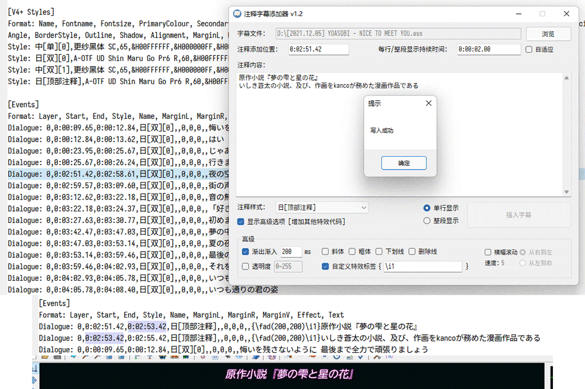
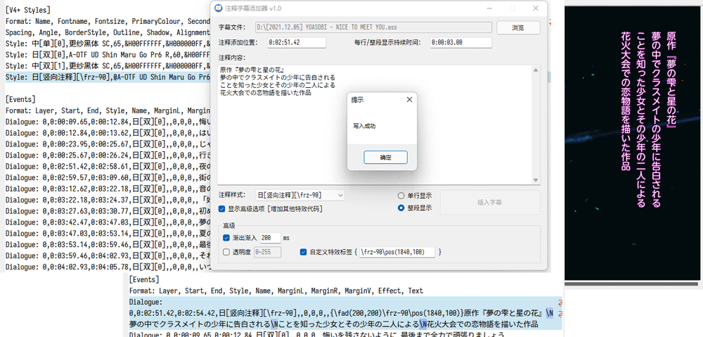

# SubtitlesCommenter

辅助视频字幕制作者为 ASS 字幕快速插入注释、说明、文化背景的 Windows 小工具

方便快速添加有固定时间间隔的字幕及应用特效标签

## 目录

- [快速入门](#快速入门)
- [下载](#下载)
- [TODO List](#todo-list)
- [Dependency](#dependency)
- [LICENSE](#license-apache-20)

## 快速入门

## 下载

 - [releases](https://github.com/hoywu/SubtitlesCommenter/releases)

## TODO List

- [x] 基础功能
- [x] 预置特效选项
- [x] 滚动效果选项
- [x] 单行长度过长提示
- [x] 自适应调整每行持续时间(实验性)
- [ ] 国际化

## Dependency

- [UTF-unknown](https://github.com/CharsetDetector/UTF-unknown) - 判断文件编码

## LICENSE Apache-2.0

[LICENSE](LICENSE)

[NOTICE](NOTICE)
